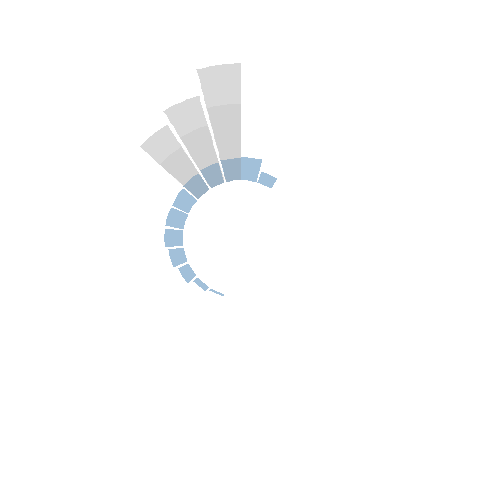
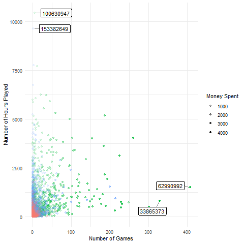
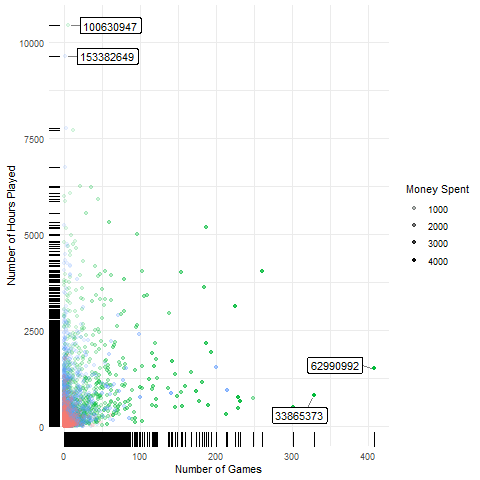
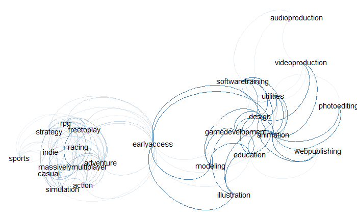
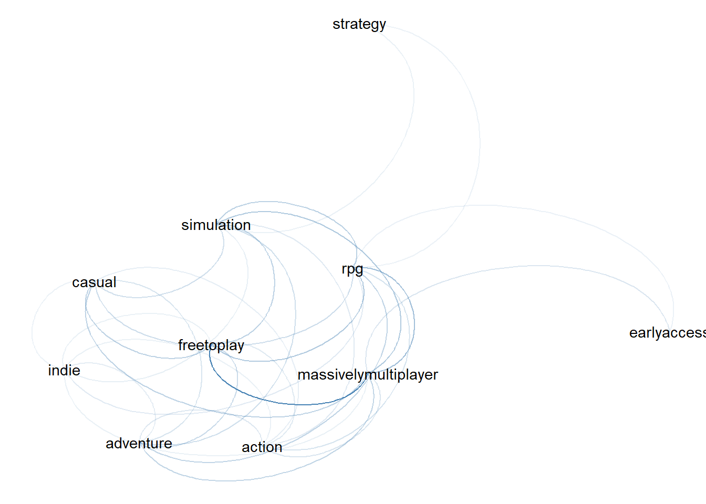
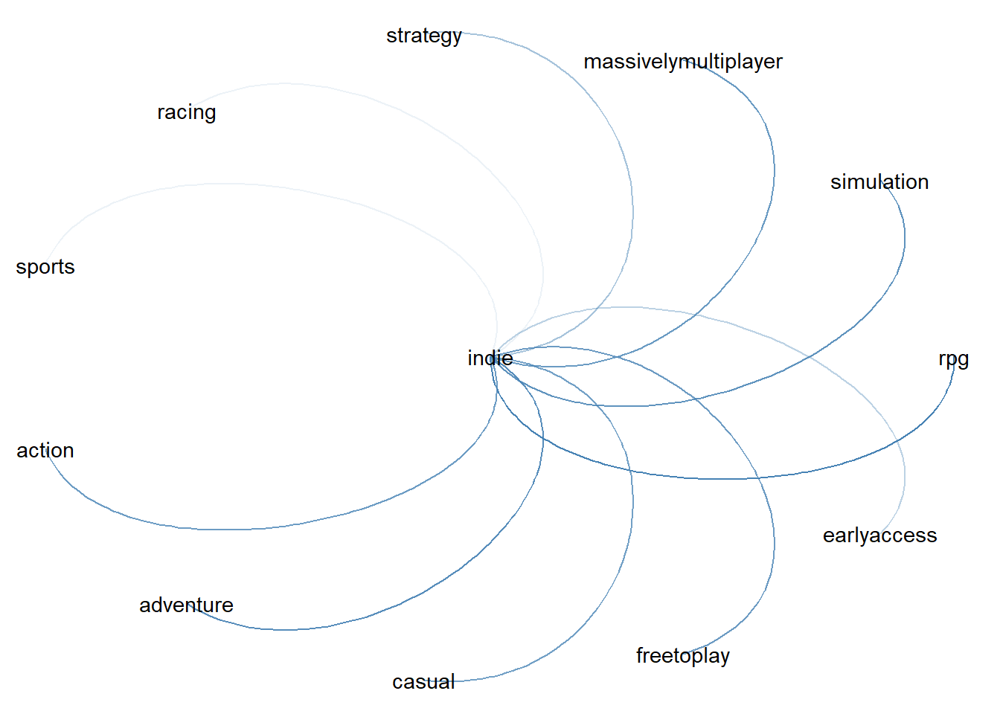
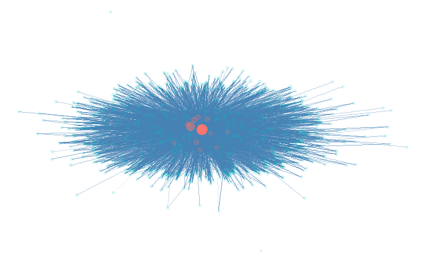

```{r setup, include=FALSE}
knitr::opts_chunk$set(echo = TRUE)
```

```{r warning=FALSE, error=FALSE, echo=F, show=F, include=F}
library(readr)
library(stringr)
library(tidyr)
library(dplyr)
library(lubridate)
library(ggplot2)
library(ggExtra)
library(packcircles)
library(ggrepel)
library(gganimate)
library(plotly)
library("RColorBrewer")

library(tidytext)
library(igraph)
library(tidygraph)
library(ggraph)

library(formattable)

#library(rrecsys)
```

```{r echo=F, eval=F, include=F}
maxy = 10

df0 =
data.frame(
  id = 22:1,
  height = c(
    1.9, 1.8, 1.7,
    rep(maxy - maxy*84/100, 3),
    maxy - maxy*87/100,
    maxy - maxy*90/100,
    maxy - maxy*95/100,
    maxy - maxy*98/100,
    rep(0, 22-10-2),
    1,2
  ),
  wings = c(
    maxy,
    maxy - maxy*22/100,
    maxy - maxy*33/100,
    rep(0, 22-3)
  )
) %>%
  mutate(frame=0)

framesnum = 20
calc_offset = function(frame) {
  offset = (frame %% 2)*maxy*30/100 + rnorm(1, maxy*5/100, 1)
  return(
    c(rep(offset, 3),
      rep(0, 22-3)
    )
  )
}

df = df0
for (i in 1:framesnum) {
  df = rbind(
    df,
    df0 %>%
      mutate(frame=i) %>%
      mutate(wings=wings-calc_offset(i))
  )
}

df = df %>%
  left_join(
    df %>%
      filter(id >= 20) %>%
      #mutate(shadow=height/2),
      mutate(
        shadow=wings*0.65 + rnorm(1, maxy*3/100, 1)
        ),
    by=c("id", "height", "wings", "frame")
  ) %>% replace_na(list(shadow=0))
```


```{r echo=F, eval=F, include=F}
p = df %>%
  ggplot(aes(x=id, y=height)) +
  geom_bar(aes(y=wings), stat="identity", fill=alpha("gray50", 0.3)) +
  geom_bar(stat="identity", fill=alpha("steelblue", 0.5)) +
  geom_bar(aes(y=shadow), stat="identity", fill=alpha("gray", 0.3)) +
  ylim(-5,11) +
  coord_polar(start = 0) +
  theme_minimal() +
  transition_states(
    frame,
    transition_length = 1,
    state_length = 0
  ) +
  #ggtitle('Now showing {closest_state}',
  #        subtitle = 'Frame {frame} of {nframes}') +
  theme(
    axis.text = element_blank(),
    axis.title = element_blank(),
    panel.grid = element_blank()#,
    #plot.margin = unit(c(-0.5,-3,-3,-2), "cm") # up, right, bottom, left
  )

animate(p, fps=30)
```
<center>

</center>

## Datasets

### Downloaded

The first dataset considered is the [Steam Video Games Dataset](https://www.kaggle.com/tamber/steam-video-games).
This dataset is a list of user behaviors, with columns: user-id, game-title, behavior-name, value. The behaviors included are 'purchase' and 'play'. The value indicates the degree to which the behavior was performed. In the case of 'purchase' the value is always 1, and in the case of 'play' the value represents the number of hours the user has played the game.
```{r echo=F}
raw_data = as_tibble(
  read.csv("steam-200k.csv", header=F,
           col.names = c( "user-id","game-title", "behavior-name", "value", "unknown")
           )
  ) %>% select(-unknown)
formattable(head(raw_data))
```
```{r include=F, eval=F}
raw_data
dim(raw_data)
raw_data %>% distinct(user.id)
raw_data %>% distinct(game.title)
raw_data %>% distinct(user.id, game.title) %>% group_by(user.id) %>% count() %>%
  ggplot(aes(x=n)) +
  geom_bar()
raw_data %>% distinct(user.id, game.title) %>% group_by(user.id) %>% count() %>%
  ggplot(aes(x=n)) +
  geom_boxplot()
```


```{r include=F, eval=F}
summary(raw_data %>% distinct(user.id, game.title) %>% group_by(user.id) %>% count() %>% ungroup() %>% select(n))
e1071::skewness( raw_data %>% distinct(user.id, game.title) %>% group_by(user.id) %>% count() %>% pull(n))
```
```{r include=F, eval=F}
raw_data %>% filter(behavior.name == "play") %>% select(user.id, value) %>% group_by(user.id) %>% summarize(value=sum(value)) %>% ungroup()
summary(
  raw_data %>% filter(behavior.name == "play") %>% select(user.id, value) %>% group_by(user.id) %>% summarize(value=sum(value)) %>% ungroup()
)

# users with most games and playtime
raw_data %>% distinct(user.id, game.title, value) %>% group_by(user.id) %>%
  summarize(playtime=sum(value), games.num=n()) %>%
  ungroup() %>%
  slice_max(games.num, n=3)
raw_data %>% distinct(user.id, game.title, value) %>% group_by(user.id) %>%
  summarize(playtime=sum(value), games.num=n()) %>%
  ungroup() %>%
  slice_max(playtime, n=3)
```


The dataset contains 200k entries relative to over 12k different users and over 5k games.
The skewness of the data, equal to 10.74, is evident, with a median of 2 and a mean of 10 game purchases per user.
Also the playtime has a high variability between gamers: from users that played for less than 5 minutes, to users with thousands and thousands of hours.
The user with the highest number of games has 1552 games with a playtime of 6778 hours.
Instead the user that spent the highest number of hours playing spent 11906 hours on 433 different games.
Sadly the dataset does not contain the period in which the hours were spent.

<!-- #### 2 -->

[Steam games complete dataset](https://www.kaggle.com/trolukovich/steam-games-complete-dataset) is the second dataset used.
In this one are listed 40k games, each with a set of information about the genre, the developer, associated tags, description, and others.
For the purpose of this assignment we are interested only in a subset of the columns, for example the url to the Steam page is not useful for us.
Follows a glimpse of the data.
```{r echo=F}
raw_data_2 = as_tibble( read.csv("steam_games.csv") ) %>%
  select(name, release_date, genre, developer, publisher, everything(),
         -url, -recent_reviews, -all_reviews, -mature_content,
         -minimum_requirements, -recommended_requirements, -discount_price)

formattable(head(raw_data_2 %>% select(name, release_date, genre, developer)))
```

### Analyzed

Because I was interested in following the connections between gamers and type of games played I've created two sub datasets:
[users_info.csv](https://github.com/Nyriu/ADS_Assignment/blob/main/users_info.csv)
is a subset of the first one, while
[games_info.csv](https://github.com/Nyriu/ADS_Assignment/blob/main/games_info.csv)
is a subset of the second.

They were created joining the initial datasets in a way that, for now on, only games with players will be considered and only player that play games for which we actually have details.
Summing up we consider 2k games and 10k users, with over 90k user-game interactions (either "purchase" or "play").
Every users plays at least one of the 2k games and every game has a description and at least one player.

```{r eval=F, include=F}
games_info_raw =
  raw_data %>%
  distinct(game.title) %>%
  arrange(game.title) %>%
  left_join(raw_data_2, by=c("game.title"="name")) %>%
  group_by(game.title) %>%
  slice(1)
data = raw_data %>%
  right_join(
    games_info_raw %>%
      filter(!is.na(types)) %>%
      filter(release_date != "NaN") %>%
      filter(release_date != "NA") %>%
      select(game.title),
    by = "game.title"
    )
games_info = games_info_raw %>%
  right_join(data %>% distinct(game.title), by="game.title")
#write.csv(games_info, "games_info.csv", row.names = F)
users_info =
  raw_data %>%
  right_join(data %>% select(user.id, game.title, behavior.name), by=c("user.id","game.title","behavior.name"))
#write.csv(users_info, "users_info.csv", row.names = F)
```

```{r error=F, warning=F, include=F}
games_info = read.csv("games_info.csv") %>%
  # date as date and not as char
  mutate( across(
    c(release_date),
    function(x) {
        parse_date(x, "%b %d, %Y",locale=locale("en"))
      }) )
games_info
users_info = read.csv("users_info.csv")
users_info
```


## About the users

### Type of gamers
Is it possible to differentiate groups of player by theirs behaviors?
The majority of people buy a lot of games or stick to a few favorites?
The plot below hints some answers at these questions.
```{r include=F}
games_prices = games_info %>%
  select(game.title, original_price) %>%
  mutate(
    price = 
      unlist( lapply(
        original_price,
        function (x) {
          y = str_remove(x, "[$]")
          tryCatch(
            as.double(y),
            error=function(z) 0,
            warning=function(z) 0
          )
        }
      )) %>% replace_na(0)
  )

users_clust_data =
  left_join(
    users_info %>%
      filter(behavior.name == "purchase") %>%
      right_join(
        games_prices %>% select(-original_price),
        by="game.title"
      ) %>%
      group_by(user.id) %>%
      summarize(titles=n(), capital=sum(price), .groups="keep") %>%
      ungroup(),
    users_info %>%
      filter(behavior.name == "play") %>%
      group_by(user.id) %>%
      summarize(hours=sum(value), .groups="keep") %>%
      ungroup(),
    by="user.id"
  ) %>%
  # Not zero but small value for log
  replace_na(list(titles=0.0001, hours=0.0001)) %>%
  mutate(capital=capital+0.0001)

users_clust_log_data =
  users_clust_data %>%
  mutate(titles = log(titles), hours = log(hours), capital=capital)

users_kmeans_3 = kmeans(users_clust_log_data, centers=3, nstart=5, iter.max = 200)
```

```{r echo=F, eval=T, include=F}
to_plot =
  rbind(
    cbind(
      users_clust_data %>% mutate(scale="default"),
      cluster=as.factor(users_kmeans_3$cluster)),
    cbind(
      users_clust_log_data %>% mutate(scale="log"),
      cluster=as.factor(users_kmeans_3$cluster)
    )
  ) %>%
  mutate(scale = as.factor(scale))

to_plot_particular =
  rbind(
    to_plot %>% filter(scale=="default") %>% slice_max(titles, n=2),
    to_plot %>% filter(scale=="default") %>% slice_max(hours,  n=2),
    to_plot %>% filter(scale=="default") %>% slice_max(capital,  n=2),
    to_plot %>% filter(scale=="log") %>% slice_max(titles, n=2),
    to_plot %>% filter(scale=="log") %>% slice_max(hours,  n=2),
    to_plot %>% filter(scale=="log") %>% slice_max(capital,  n=2)
  ) %>% arrange(user.id) %>%
  distinct(user.id,scale, .keep_all = T)
```


```{r echo=F, eval=F, include=F}
to_plot %>%
  filter(scale=="default") %>%
  #filter(scale=="log") %>%
  ggplot(aes(x=titles, y=hours)) +
  geom_point(aes(alpha=capital, color=cluster)) +
  geom_smooth(color="magenta", alpha=0.5) +
  geom_rug() +
  geom_label_repel(
    data=to_plot_particular %>% filter(scale=="default"),
    #data=to_plot_particular %>% filter(scale=="log"),
    aes(label = user.id),
    box.padding   = 0.35, 
    point.padding = 0.35,
    segment.color = 'grey50'
    ) +
  xlab("Number of Games") +
  ylab("Number of Hours Played") +
  guides(color=FALSE) +
  theme_minimal() +
  labs( alpha="Money Spent")

to_plot %>%
  filter(scale=="default") %>%
  #filter(scale=="log") %>%
  ggplot(aes(x=capital, y=hours)) +
  geom_point(aes(alpha=capital, color=cluster)) +
  geom_smooth(color="magenta", alpha=0.5) +
  geom_rug() +
  geom_label_repel(
    data=to_plot_particular %>% filter(scale=="default"),
    #data=to_plot_particular %>% filter(scale=="log"),
    aes(label = user.id),
    box.padding   = 0.35, 
    point.padding = 0.35,
    segment.color = 'grey50'
    ) +
  #xlab("Number of Games") +
  #ylab("Number of Hours Played") +
  #guides(color=FALSE) +
  theme_minimal() #+
  #labs( alpha="Money Spent")

to_plot %>%
  filter(scale=="default") %>%
  #filter(scale=="log") %>%
  ggplot(aes(x=capital, y=titles)) +
  geom_point(aes(alpha=capital, color=cluster)) +
  geom_smooth(color="magenta", alpha=0.5) +
  geom_rug() +
  geom_label_repel(
    data=to_plot_particular %>% filter(scale=="default"),
    #data=to_plot_particular %>% filter(scale=="log"),
    aes(label = user.id),
    box.padding   = 0.35, 
    point.padding = 0.35,
    segment.color = 'grey50'
    ) +
  #xlab("Number of Games") +
  #ylab("Number of Hours Played") +
  #guides(color=FALSE) +
  theme_minimal() #+
  #labs( alpha="Money Spent")
```
```{r echo=F, eval=F, include=F}
to_plot %>%
  filter(scale=="log") %>%
  ggplot(aes(x=titles, y=hours)) +
  geom_point(aes(alpha=capital, color=cluster)) +
  geom_smooth(color="magenta", alpha=0.5) +
  geom_rug() +
  geom_label_repel(
    data=to_plot_particular %>% filter(scale=="log"),
    #data=to_plot_particular %>% filter(scale=="log"),
    aes(label = user.id),
    box.padding   = 0.35, 
    point.padding = 0.35,
    segment.color = 'grey50'
    ) +
  xlab("Number of Games") +
  ylab("Number of Hours Played") +
  guides(color=FALSE) +
  theme_minimal() +
  labs( alpha="Money Spent")

to_plot %>%
  filter(scale=="log") %>%
  ggplot(aes(x=log(capital), y=hours)) +
  geom_point(aes(alpha=capital, color=cluster)) +
  geom_smooth(color="magenta", alpha=0.5) +
  geom_rug() +
  geom_label_repel(
    data=to_plot_particular %>% filter(scale=="log"),
    #data=to_plot_particular %>% filter(scale=="log"),
    aes(label = user.id),
    box.padding   = 0.35, 
    point.padding = 0.35,
    segment.color = 'grey50'
    ) +
  #xlab("Number of Games") +
  #ylab("Number of Hours Played") +
  #guides(color=FALSE) +
  theme_minimal() #+
  #labs( alpha="Money Spent")

to_plot %>%
  filter(scale=="log") %>%
  ggplot(aes(x=log(capital), y=titles)) +
  geom_point(aes(alpha=capital, color=cluster)) +
  geom_smooth(color="magenta", alpha=0.5) +
  geom_rug() +
  geom_label_repel(
    data=to_plot_particular %>% filter(scale=="log"),
    #data=to_plot_particular %>% filter(scale=="log"),
    aes(label = user.id),
    box.padding   = 0.35, 
    point.padding = 0.35,
    segment.color = 'grey50'
    ) +
  #xlab("Number of Games") +
  #ylab("Number of Hours Played") +
  #guides(color=FALSE) +
  theme_minimal() #+
  #labs( alpha="Money Spent")
```
```{r include=F}
mean  (to_plot %>% pull(titles))
median(to_plot %>% pull(titles))

mean  (to_plot %>% pull(hours))
median(to_plot %>% pull(hours))

mean  (to_plot %>% pull(capital))
median(to_plot %>% pull(capital))
```


```{r echo=F, eval=F, include=F}
# ANIMATED
funx = function(x) {
  if (x == "log") {
    return("log(# of Games)")
  } else {
    return("Number of Games")
  }
}
funy = function(x) {
  if (x == "log") {
    return("log(# of Hours Played)")
  } else {
    return("Number of Hours Played")
  }
}

to_plot %>%
  ggplot(aes(x=titles, y=hours)) +
  geom_point(aes(alpha=capital, color=cluster)) +
  geom_rug() +
  geom_label_repel(
    data=to_plot_particular,
    aes(label = user.id),
    box.padding   = 0.4, 
    #point.padding = 0.35,
    point.padding = 0.4,
    segment.color = 'grey50'
    ) +
  transition_states(scale,
                    transition_length = 2,
                    state_length = 2) +
  ease_aes('cubic-in-out') +
  view_follow() +
  xlab(funx("{closest_state}")) +
  ylab(funy("{closest_state}")) +
  
  theme_minimal() +
  guides(color=FALSE) +
  labs( alpha="Money Spent")

```


The plot animation cycles between the scale of the data and a logarithmic scale, thus giving two different perspectives:

* in the default scale we can see that the data is clustered near the origin, this means that the users' majority has bought a small number of games and has played them few hours.
  Analyzing the data summaries, mean of 3.11 (median 1) games, 98.5 (3.20) hours and 52.8 (0) dollars spent.
  Also, it seems that there is not a linear relationship between number of games and playtime, meaning that the users tend to buy and play for a small period of time the new games.
  Worth nothing that the money invested does not seem to be a reason to play, that's interesting specially given the linearity between the money spent and the number of games.
  
* the log-scale gives a better understanding of the 3 cluster (generated with k-means) showing that the red cluster captures people with low budget and low free time, the blue cluster comprehend people above the average but not as extreme gamers as the green cluster.
 The blue and the green group overlap a bit but together are definitely separated from the red group.
 
 
<!--  -->
<!--  -->



# What about the highlited gamers

Inspecting more about the highlighted users, that are the four most extreme users, gives us the following plot.
```{r include=F}
## Creare dati per pie di tempo e soldi
pie_data =
users_info %>%
  filter(behavior.name == "play") %>%
  right_join(
    rbind(
      users_clust_data %>% slice_max(titles, n=2),
      users_clust_data %>% slice_max(hours,  n=2),
      users_clust_data %>% slice_max(capital,  n=2) ) %>%
      distinct(user.id, .keep_all = T),
    by="user.id"
  ) %>%
  left_join(
    games_prices,
    by="game.title"
  ) %>%
  select(-behavior.name, -original_price) %>%
  group_by(user.id) %>%
  mutate(hours_total = sum(value)) %>%
  ungroup() %>%
  mutate(hours_perc = value/hours_total, hours=value, capital_perc=price/capital) %>%
  select(user.id, game.title, price, hours, hours_perc, capital_perc, hours_total, capital)

pie_data_top =
  pie_data %>%
  group_by(user.id) %>%
  filter(hours_perc > 0.03) %>%
  arrange(desc(hours_perc)) %>%
  slice(1:6) %>% # Keep only top k played for each gamer
  ungroup()


pie_data_others = data.frame(
  user.id=
    unlist( lapply(
      setdiff(
        paste(pie_data$user.id,  pie_data$game.title, sep="$"),
        paste(pie_data_top$user.id,  pie_data_top$game.title, sep="$") ),
      
      function (x) {
        as.integer(unlist(str_split(x, "[$]"))[[1]])
      }
    )),
  game.title=
    unlist( lapply(
      setdiff(
        paste(pie_data$user.id,  pie_data$game.title, sep="$"),
        paste(pie_data_top$user.id,  pie_data_top$game.title, sep="$") ),
      function (x) {
        unlist(str_split(x, "[$]"))[[2]]
      }
    ))
  ) %>%
  left_join(pie_data, by=c("user.id","game.title")) %>%
  group_by(user.id) %>%
  summarise(
    price=sum(price),
    hours=sum(hours),
    hours_perc=sum(hours_perc),
    capital_perc=sum(capital_perc)
  ) %>%
  ungroup() %>%
  mutate(game.title="Others")

```


```{r echo=F}
to_plot =
  pie_data_top %>% add_row(pie_data_others) %>%
    arrange(user.id, desc(game.title)) %>%
    group_by(user.id) %>%
    ungroup()

dispositions = c(
  0,0,
  0,1,
  1,0,
  1,1
)

fig = plot_ly()
i = 1
for (user in (to_plot %>% distinct(user.id) %>% pull())) {
  data = to_plot %>%
    filter(user.id == user) %>% select(game.title, hours) %>%
    mutate(label = paste(game.title, paste(hours, "h", sep=""), sep="\n"))
  fig = fig %>%
    add_pie(data=data,
            labels = ~label,
            values = ~hours,
            name = user,
            domain = list(row=dispositions[[i]], column=dispositions[[i+1]]),
            #title = list(title="test"),
            textinfo='percent',
            hoverinfo='label'
    )
  i = i + 2
}
  

x1 = 0.02
x2 = 0.53
y1 = 0.16
y2 = 0.75

fig = fig %>%
  layout(#title = "Pie Charts with Subplots",
    showlegend = F,
    grid=list(rows=2, columns=2),
    xaxis = list(showgrid = FALSE, zeroline = FALSE, showticklabels = FALSE),
    yaxis = list(showgrid = FALSE, zeroline = FALSE, showticklabels = FALSE),
    annotations = list(
      list(
        x = x1,
        y = y2,
        text = (to_plot %>% distinct(user.id) %>% pull())[[1]],
        font = list(size = 16), 
        showarrow = FALSE,
        textangle=-90
      ),
      list(
        x = x2,
        y = y2,
        text = (to_plot %>% distinct(user.id) %>% pull())[[2]],
        font = list(size = 16), 
        showarrow = FALSE,
        textangle=-90
      ),
      list(
        x = x1,
        y = y1,
        text = (to_plot %>% distinct(user.id) %>% pull())[[3]],
        font = list(size = 16), 
        showarrow = FALSE,
        textangle=-90
      ),
      list(
        x = x2,
        y = y1,
        text = (to_plot %>% distinct(user.id) %>% pull())[[4]],
        font = list(size = 16), 
        showarrow = FALSE,
        textangle=-90
      )
    )
  )
fig
```

It's funny to see that the players with the higher number of hours spent all the time with one game.
Note also that both the games are free to play.
```{r include=F }

# calcolo ore medie per gioco per giocatore "extreme"

pie_data %>%
  group_by(user.id) %>%
  mutate(
    hours_mean     = mean(hours),
    hours_median = median(hours),
    price_mean     = mean(price),
    price_median = median(price)
  ) %>%
  distinct(user.id, hours_mean,
           hours_median, price_mean,
           price_median )
pie_data %>%
  group_by(user.id) %>%
  count()

1066 / (212 - 5)

```
The users in the first row had respectively spent a mean of 13 and 11 dollars on each game, playing them with and average of 10 and 7 hours per game.
The second user (upper right) bought 212 games, and, excluding the five shown, spent an average of 5.1 hours per game.
Note that very few games can be completed in such a few hours.

Follows an interactive plot to better explore the users' preferences.

```{r echo=F}
p = pie_data %>%
  select(user.id, game.title, price, hours) %>%
  ggplot(aes(x=price, y=hours, text=game.title)) +
  geom_point(aes(alpha=0.2)) +
  #geom_rug() +
  facet_wrap(~user.id, scale="free_y") +
  theme_minimal() +
  xlab("Price") +
  ylab("Hours")

ggplotly(p, tooltip = c("text"))

```


## About the games

Newer games have more playtime than older games?
The playtime is evenly distributed?
If not what are the factors that determine the higher playtime?

<!--
Oppure ci sono picchi di giocatori nei tempi sucessivi al rilascio e poi piano piano sfuma?
Non possibile rispondere a questa domanda con il dataset attuale
-->

```{r include=F}
to_plot =
games_info %>%
  left_join(users_info %>% filter(behavior.name == "play"), by="game.title") %>%
  select(game.title, release_date, value) %>%
  group_by(game.title) %>%
  summarize(playtime=sum(value), release_date = release_date, .groups="keep") %>%
  slice(1) %>%
  ungroup() %>%
  replace_na(list(playtime=0)) %>%
  
  left_join(
    users_info %>%
      filter(behavior.name == "purchase") %>%
      select(game.title, value) %>%
  group_by(game.title) %>%
  summarize(purchases=sum(value), .groups="keep") %>%
  ungroup(), by="game.title") %>%
  select(game.title, release_date, everything()) %>%
  
  filter(!is.na(release_date))

to_plot
```


```{r echo=F}
p = to_plot %>%
  ggplot(aes(x=release_date, y=log(playtime + 0.0001),
             label=game.title, text=game.title
  )) +
  geom_point( aes(alpha=log(purchases)), color="slateblue") +
  theme_minimal() +
  theme( legend.position="bottom") +
  xlab("Release Date") +
  ylab("Playtime in log(hours)") +
  scale_y_continuous(labels = 
                       c(
                         "log(~0)   ", #  = -10",
                         "log(~0)   ", #  =  -5",
                         "log(1)    ", #  =   0",
                         "log(150)  ", #  =   5",
                         "log(22000)", #  =  10",
                         "log()     "  #  =  15"
                       )
                     
  ) +
  scale_alpha_continuous( labels = c(
    "log(1)   ", #=0",
    "log(10)  ", #=2",
    "log(50)  ", #=4",
    "log(500) ", #=6",
    "log(3000)"  #=8"
  )) +
  labs( alpha="log(# of Purchases)") +
  geom_label_repel(
    data=to_plot %>% slice_max(purchases, n=2),
    box.padding   = 0.35, 
    point.padding = 0.25,
    segment.color = 'grey50'
  ) +
  geom_label_repel(
    data=to_plot %>% slice_max(release_date, n=1),
    box.padding   = 0.25, 
    point.padding = 0.75,
    segment.color = 'grey50'
  ) +
  geom_label_repel(
    data=to_plot %>% slice_min(release_date, n=2),
    box.padding   = 0.45, 
    point.padding = 0.25,
    segment.color = 'grey50'
  )

gm = ggMarginal(p, type="histogram", color="white", fill="slateblue")
gm
```

The majority of the games were released between 2013 and 2020 but there's two game far on the left of the plot:

* [Dragon's Lair](https://store.steampowered.com/app/227380/Dragons_Lair/), an interactive film video game published in 1983.
In the game the protagonist Dirk the Daring is a knight attempting to rescue Princess Daphne from the evil dragon Singe who has locked the princess in the foul wizard Mordroc's castle. It featured animation by ex-Disney animator Don Bluth.

* [Space Ace](https://store.steampowered.com/app/240340/Space_Ace/) was unveiled in October 1983, just four months after the Dragon's Lair game, then released in Spring 1984, and like its predecessor featured film-quality animation.
The gameplay is similar to Dragon's Lair, requiring the player to move the joystick or press the fire button at key moments in the animated sequences to govern the hero's actions.

<!-- There is also the occasional option to either temporarily have the character transform into his adult form or remain as a boy with different styles of challenge. -->

This two are widely considered videogame's history gems.


About the playtime we can see that the distribution is almost normal if we do not consider the huge quantity of games played for few minutes.
It seems that a game is either played for a short period of time and then dislikes, or played for about 100 hours.
The games with the highest play time are [Team Fortress 2](https://store.steampowered.com/app/440/Team_Fortress_2/) and [Dota 2](https://store.steampowered.com/app/570/Dota_2/), both FreeToPlay Action Multiplayer PvP games.
The latter, since the 2013 release, hoarded almost 1 million hours of playtime distributed over 5k players.
Team Fortress 2, released in 2007, accumulated more than 150k hours with less than 2500 users.

```{r include=F}
to_plot %>% slice_max(purchases, n=2)

```


Noting that both the top games are FreeToPlay raises a question: what kind of relationship binds the game genre with its popularity?
Which are the most popular genres, measuring popularity with purchases or playtime?

```{r include=F}
# trovo numero min e max di generi associati ad un gioco
#about_genres_data = 
games_info %>%
  select(game.title, genre) %>%
  mutate( genre_num = 
      unlist( lapply(genre, 
             function(x) {
               l = unlist(str_split(x, pattern=","))
               if (l[[1]] == "") {
                 return(0)
               }
               return(length(unlist(str_split(x, pattern=","))))
             } ))) %>%
  count(genre_num) %>%
  ggplot(aes(x=genre_num, y=n)) +
  geom_bar(stat = "identity", show.legend = F)
```

First of all most games belong to at least two genres, and there are 22 different genres in the dataset.

```{r echo=F}
# trovo quanti generi differenti
to_plot =
  data.frame(genre = 
     unlist( lapply( games_info %>% pull(genre),
                     function(x) {
                       unlist(str_split(x, pattern=","))
                     } )
  )) %>%
  count(genre) %>%
  filter(genre != "") %>%
  #mutate(n=log(n))
  #mutate(n=sqrt(n))
  mutate(label=ifelse(n < 20, "", genre))

packing <- circleProgressiveLayout(to_plot$n, sizetype='area')
to_plot <- cbind(to_plot, packing)

dat.gg <- circleLayoutVertices(packing, npoints=50)

ggplot() +
  # Make the bubbles
  geom_polygon(data = dat.gg, aes(x, y, group = id, fill=as.factor(id)), colour = "black", alpha = 0.6) +
  # Add text in the center of each bubble + control its size
  geom_text(data = to_plot, aes(x, y, size=n, label = label)) +
  scale_size_continuous(range = c(1,4)) +
  # General theme:
  theme_void() + 
  theme(legend.position="none") +
  coord_equal()
```

In the plot above the area of the circles is proportional to the number of games that belong to the genre.
The most frequent is Indie with 1223 titles followed by Action (900), Adventure (582) and Strategy (496).
Note that FreeToPlay occupy the 8-th position.
This huge difference in the genre presence on the store may be caused by the diffent business strategies.
The Indie games usually are developed by small groups and sometimes by solo-developers, instead big FreeToPlay need a huge initial investment that's mitigated fidelizing the palyers.
The income of an indie game comes from the number of units sold, the income of a FreeToPlay comes from in-game purchases of skins, cosmetics and items.
So a FreeToPlay adopts a strategy that's almost opposite to the one adopted by and inde game.

Also the number of Indie games is extremely increased in the last years because of the accessibility of powerful tools and because of the possibility of reaching a huge audience of customers.

```{r echo=F}
genre_pop =
  games_info %>%
  filter(!is.na(release_date)) %>%
  select(game.title, genre, release_date) %>%
  mutate(
    genres =
      lapply( genre,
              function(x) {
                data.frame(
                  genres = unlist(str_split(x, pattern=","))
                )
              }
      )
  ) %>%
  unnest(genres) %>%
  select(release_date, genre=genres) %>%
  mutate(value=1) %>%
  
  arrange(genre, release_date) %>%
  group_by(genre) %>%
  mutate(to_date=cumsum(value)) %>%
  filter(genre != "")

genre_pop_top9 =
  genre_pop %>%
  # top 9
  filter(
    genre %in%
      (genre_pop %>%
         arrange(desc(to_date)) %>%
         group_by(genre) %>%
         slice(1) %>%
         ungroup() %>%
         arrange(desc(to_date)) %>% pull(genre))[1:9]
  )
genre_pop_top9 %>%
  ggplot(aes(x=release_date, y=to_date, color=genre)) +
  geom_line(show.legend = F) + 
  #geom_point() +
  facet_wrap(~genre) #+ #theme_minimal()
```

Note the huge difference between the presence of Indie games and FreeToPlay (F2P) over the years.
Once a F2P game has been released, the developers stick to the game to add new content, sometimes even monthly.
On the other hand for a small Indie company it's better to release frequently smaller games.

To confirm this different business strategy we should look at the playtime for every genre and note that the Indie genre collected less hours than the F2P genre, the plot below aims at doing that.


```{r echo=F, include=F, eval=F}
genre_pop_top9 %>%
#genre_pop[1:2000,] %>%
  filter(year(release_date) > 2000 ) %>%
  ggplot(aes(x=genre, y=to_date, fill=genre)) + 
  geom_bar(stat='identity', show.legend = F) +
  #theme_bw() +
  transition_states(
    year(release_date),
    transition_length = 2,
    state_length = 2
  ) +
  ease_aes('sine-in-out') +
  #view_follow() + # does NOT work
  ggtitle('Now showing {closest_state}',
          subtitle = 'Frame {frame} of {nframes}')
```


```{r echo=F, warning=F}
genres_playtime =
  data.frame(genre = 
     unlist( lapply( games_info %>% pull(genre),
                     function(x) {
                       unlist(str_split(x, pattern=","))
                     } )
  )) %>%
  filter(genre != "") %>%
  arrange(genre) %>%
  count(genre) %>%
  
  mutate(playtime_abs=0)

has_genre = function(x) {
  grepl(g, x, fixed = TRUE)
}

for (g in genres_playtime$genre) {
  k = games_info %>%
      filter(has_genre(genre)) %>%
      select(game.title) %>%
    left_join(
      users_info %>%
        filter(behavior.name == "play") %>%
        select(game.title, value),
      by="game.title"
    ) %>%
    replace_na(list(value=0)) %>%
    summarise(val = sum(value)) %>% pull()
    
  genres_playtime$playtime_abs[genres_playtime$genre == g] = k
}

genres_playtime = genres_playtime %>%
  mutate(playtime_rel=playtime_abs/n) %>%
  arrange(playtime_abs) %>%
  mutate ( id = row_number() ) %>%
  mutate(
    angle =
      90 - 360 * (id - 0.5) /nrow(genres_playtime)
  ) %>%
  mutate (
    hjust = ifelse(angle < -90, 1, 0)
  ) %>%
  mutate (
    angle = ifelse(angle < -90, angle+180, angle)
  )
```


```{r echo=F, warning=F, include=F}
genres_playtime %>%
  ggplot(aes(x=reorder(genre, playtime_abs), y=playtime_abs)) +
  geom_bar(stat="identity", fill=alpha("steelblue", 0.5)) +
  #geom_bar(aes(y=-playtime_rel*50), stat="identity", fill=alpha("red", 0.5)) +
  ylim(-1050000,2000000) +
  theme_minimal() +
  theme(
    axis.text = element_blank(),
    axis.title = element_blank(),
    panel.grid = element_blank(),
    plot.margin = unit(c(-0.5,-3,-3,-2), "cm") # up, right, bottom, left
  ) +
  coord_polar(start = 0) 

genres_playtime %>%
  ggplot(aes(x=reorder(genre, playtime_abs), y=playtime_abs)) +
  geom_bar(stat="identity", fill=alpha("steelblue", 0.5)) +
  #geom_bar(aes(y=-(playtime_rel*playtime_rel)/log(playtime_rel)), stat="identity", fill=alpha("red", 0.5)) +
  geom_bar(aes(y=-playtime_rel*50), stat="identity", fill=alpha("red", 0.5)) +
  ylim(-1050000,2000000) +
  theme_minimal() +
  theme(
    axis.text = element_blank(),
    axis.title = element_blank(),
    panel.grid = element_blank(),
    plot.margin = unit(c(-0.5,-3,-3,-2), "cm") # up, right, bottom, left
  ) +
  coord_polar(start = 0) +
  geom_text(
    aes(y=playtime_abs + 100000, label=genre, hjust=hjust),
    color="black", fontface="bold",alpha=0.6, size=2.5, angle= genres_playtime$angle#, inherit.aes = FALSE
    ) 

```

```{r echo=F, warning=F}
## Animating example above
d1 = genres_playtime %>%
  mutate(
    label="",
    #labely=0,
    labely=playtime_abs + 100000,
    #labely=2500000,
    #labely=3000000,
    #hjust=0,
    playtime_rel=0,
    phase=1
  )

d2 = genres_playtime %>%
  mutate(
    label=genre,
    labely=playtime_abs + 100000,
    phase=2
  )

d = rbind(d1,d2)

d %>%
  ggplot(aes(x=reorder(genre, playtime_abs), y=playtime_abs)) +
  geom_bar(stat="identity", fill=alpha("steelblue", 0.5)) +
  geom_bar(aes(y=-playtime_rel*50), stat="identity", fill=alpha("red", 0.5)) +
  ylim(-1050000,2000000) +
  theme_minimal() +
  theme(
    axis.text = element_blank(),
    axis.title = element_blank(),
    panel.grid = element_blank()#,
    #plot.margin = unit(c(-0.5,-3,-3,-2), "cm") # up, right, bottom, left
  ) +
  coord_polar(start = 0) +
  geom_text(
    aes(y=labely, label=label, hjust=hjust),
    color="black", fontface="bold",alpha=0.6, size=2.5, angle= d$angle #, inherit.aes = FALSE
    ) +
  transition_states(
    phase,
    transition_length = 2,
    state_length = 2
  ) +
  #enter_fade(alpha=0.5) +
  #exit_fade(alpha=0.2) +
  #ease_aes('sine-in-out') +
  ease_aes('quadratic-in-out') #+
  #ease_aes('quadratic-in') #+
  #ggtitle('Now showing {closest_state}',
  #        subtitle = 'Frame {frame} of {nframes}')

```

The blue columns show the total playtime of each genre, while the red bars show the users' "fidelity" to a game.
The fidelity is measured as the total playtime divided by the number of users.
Note that even if Indie is the most popular game its total playtime is far less from the one of Action or F2P.
Also note the "fidelity" of the users of Indie games: in proportion to the total playtime is one of the lowest.
Instead the "fidelity" of the F2P games is really high.


Until now we have not analyzed the probability of a game to belong to different genres.
In the graph below this probability is visualized with the edge presence and its strength.

```{r echo=F}
games_bigr_counts =
  games_info %>%
  select(genre) %>%
  mutate(genre=gsub(" ", "", genre)) %>%
  mutate(genre=gsub(",", " ", genre)) %>%
  mutate(genre=paste("init", genre, "end", sep = " ")) %>%
  unnest_tokens(bigram, genre, token = "ngrams", n = 2) %>%
  separate(bigram, c("word1", "word2"), sep = " ") %>%
  count(word1, word2, sort = TRUE) %>%
  filter(
    word1 != "init" & word1 != "end" &
    word2 != "init" & word2 != "end"
  )
```


```{r echo=F, include=F}
# create the graph
bigram_graph <- games_bigr_counts %>%
  filter(n > 10) %>%
  as_tbl_graph()

a <- grid::arrow(type = "closed", length = unit(.1, "inches"))
ggraph(bigram_graph, layout = "fr") +
  geom_edge_arc2(aes(edge_alpha=n), color="steelblue", show.legend = F, arrow = a, end_cap=circle(0.06, "inches")) +
  geom_node_point(color="steelblue") +
  geom_node_text(aes(label = name), vjust=1, hjust=1) +
  theme_void()

```

```{r echo=F}
genre_freq =
  games_info %>%
  filter(!is.na(release_date)) %>%
  select(game.title, genre, release_date) %>%
  mutate(
    genres =
      lapply( genre,
              function(x) {
                data.frame(
                  genres = unlist(str_split(x, pattern=","))
                )
              }
      )
  ) %>%
  unnest(genres) %>%
  select(genre=genres) %>%
  group_by(genre) %>%
  count(sort = T) %>%
  mutate(genre=gsub(" ", "", genre))

genres_freq_sum =
  #genre_freq[1:5,] %>% mutate(fake=1) %>%
  genre_freq %>% mutate(fake=1) %>%
  full_join(
    #genre_freq[1:5,] %>% mutate(fake=1),
    genre_freq %>% mutate(fake=1),
    by = "fake") %>%
  filter(genre.x != genre.y) %>%
  select(-fake) %>%
  mutate(
    genre.sum = paste(genre.x, genre.y, sep=""),
    n.sum = n.x+n.y
  ) %>%
  select(genre=genre.sum, genre_freq=n.sum) %>%
  mutate(genre=tolower(genre))
```

```{r echo=F}
## Corrected count
games_bigr_counts =
  data.frame(
    genre = 
      unlist(
        lapply(
          unlist(
            lapply(
              games_info %>%
                select(genre) %>%
                mutate(genre=gsub(" ", "", genre)) %>%
                mutate(genre=gsub(",", " ", genre)) %>%
                pull(genre),
              function (x){
                combinat::permn(
                  unlist(str_split(x, pattern=" "))
                )
              }
            ),
            recursive = F
          ),
          function (x){
            paste(x, collapse = " ")
          }
        ))
  ) %>%
  mutate(genre=paste("init", genre, "end", sep = " ")) %>%
  unnest_tokens(bigram, genre, token = "ngrams", n = 2) %>%
  separate(bigram, c("word1", "word2"), sep = " ") %>%
  count(word1, word2, sort = TRUE) %>%
  filter(
    word1 != "init" & word1 != "end" &
    word2 != "init" & word2 != "end"
  )  %>%
  mutate(genre=paste(word1, word2, sep="")) %>%
  left_join(genres_freq_sum, by="genre") %>%
  mutate(ndivfreq = n/genre_freq)
```


```{r echo=F, include=F}
games_bigr_counts %>%
  filter(word1 > word2) %>%
  as_tbl_graph() %>%
  ggraph(layout = "fr") +
  geom_edge_arc(aes(edge_alpha=ndivfreq), color="steelblue", show.legend = F) +
  
  geom_node_text(aes(label = name)) +
  theme_void()
```

<center>

</center>

The first thing to note is the division in two different clusters.
Interestingly one cluster is stronger because it is composed by utility software with a really specific purpose.
This software have nothing in common with the games of the other cluster.

The next plot zooms into the game cluster.

```{r echo=F, eval=F, include=F}
interesting_genres = c(
  "indie",
  "action", "freetoplay",
  "massivelymultiplayer",
  "adventure",
  "casual",
  "rpg",
  "strategy"
)


lvl=5
games_bigr_counts %>%
  filter(
    word1 %in% interesting_genres |
      word2 %in% interesting_genres
  ) %>%
  filter(word1 > word2) %>%
  filter(ndivfreq > lvl) %>%
  as_tbl_graph() %>%
  ggraph(layout = "fr") +
  geom_edge_arc(aes(edge_alpha=ndivfreq), color="steelblue", show.legend = F) +
  geom_node_text(aes(label = name)) +
  theme_void()
```

<center>

</center>

The first thing to note is that F2P and Massively Multiplayer (Online) (MMO) are strongly related, thus confirming the business strategy hinted before: create a big community that keeps playing over the years.
Note also that Indie is loosely connected with F2P and almost not connected at all with MMO.


```{r echo=F, include=F}
games_bigr_counts %>%
  filter(
    word1 == "indie" | word2 == "indie"
  ) %>%
  filter(word1 > word2) %>%
  as_tbl_graph() %>%
  ggraph(layout = "star") +
  geom_edge_arc(aes(
    edge_alpha=ndivfreq), color="steelblue", show.legend = F) +
  
  geom_node_text(aes(label = name)) +
  theme_void()

plot(p)
```
<!--
<center>


</center>
-->


```{r include=F, eval=F}
## TENTATIVO di animazione
## Raccolgo i dati dei 3 plot

d1 = games_bigr_counts %>%
  filter(word1 > word2)

d2_genres = c(
  "indie","action", "freetoplay", "massivelymultiplayer",
  "adventure", "casual", "rpg", "strategy"
)
d2 = games_bigr_counts %>%
  filter(
    word1 %in% d2_genres |
    word2 %in% d2_genres
    ) %>%
  filter(word1 > word2) %>%
  filter(ndivfreq > 5)
  
d3 = games_bigr_counts %>%
  filter(
    word1 == "indie" | word2 == "indie"
    ) %>%
  filter(word1 > word2)
  
d123 = rbind(
  d1 %>% mutate(dnum=1),
  d2 %>% mutate(dnum=2),
  d3 %>% mutate(dnum=3)
)
g123 = d123 %>%
  as_tbl_graph()

g1 = d1 %>% as_tbl_graph()
g2 = d2 %>% as_tbl_graph()
g3 = d3 %>% as_tbl_graph()
```


```{r include=F, eval=F}
p1 = g1 %>%
  ggraph(layout = "fr") +
  geom_edge_arc(aes(edge_alpha=ndivfreq), color="steelblue", show.legend = F) +
  geom_node_text(aes(label = name)) +
  theme_void()
p2 = g2 %>%
  ggraph(layout = "fr") +
  geom_edge_arc(aes(edge_alpha=ndivfreq), color="steelblue", show.legend = F) +
  geom_node_text(aes(label = name)) +
  theme_void()
p3 = g3 %>%
  ggraph(layout = "fr") +
  geom_edge_arc(aes(edge_alpha=ndivfreq), color="steelblue", show.legend = F) +
  geom_node_text(aes(label = name)) +
  theme_void()
```


```{r include=F, eval=F}
#graph123 %>%
g123 %>%
  ggraph(layout = "fr") +
  geom_edge_arc(aes(edge_alpha=ndivfreq), color="steelblue", show.legend = F) +
  geom_node_text(aes(label = name)) +
  theme_void() +

  transition_states(dnum,
                    transition_length = 2,
                    state_length = 2) +
  #ease_aes('cubic-in-out') +
  ease_aes("quadratic-in-out") +
  enter_fade() +
  exit_fade() +
  view_zoom() +
  #view_follow() +
  ggtitle('Now showing {closest_state}',
          subtitle = 'Frame {frame} of {nframes}')
  

## TENTATIVO FALLITO
```


## About user-games interactions
Looking at games and users as nodes of a bipartite graph connected by the hours of play, I was able to produce the graph below.


```{r echo=F}
isnumeric = function(y){
 is.numeric(
   tryCatch(
   as.integer(y),
    warning=function(x) "nope",
    error=function(x) "nope"
    )
  )
}

isnumeric_list = function(y) {
  unlist(
    lapply(
      y,
      isnumeric
    )
  )
}
```


```{r echo=F}
g =
#users_info[1:20, ] %>%
  users_info %>%
  filter(behavior.name == "play") %>%
  select(user.id, game.title, hours=value) %>%
  #group_by(user.id, game.title) %>%
  #slice_head(n=100) %>%
  #ungroup() %>%
  as_tbl_graph() %>%
  activate(nodes) %>%
  mutate(nodetype=ifelse(isnumeric_list(name), "user", "game")) %>%
  mutate(centrality = centrality_eigen()) %>%
  mutate(out_deg = centrality_degree(mode="out")) %>%
  mutate(in_deg = centrality_degree(mode="in"))
```


```{r echo=F, include=F, eval=F}
g %>%
  ggraph(layout = "fr") +
  #ggraph(layout = "linear", circular=T) +
  #ggraph(layout = "partition") +
  geom_edge_arc(aes(edge_alpha=log(hours)), color="steelblue", show.legend = F) +
  #geom_edge_link(color="steelblue", show.legend = F) +
  geom_node_point(aes(color = nodetype)) +
  #geom_node_point(aes(filter = is_user), color="red") +
  #geom_node_point(aes(filter = is_game), color="blue") +
  #geom_node_text(aes(label = name)) +
  #geom_node_text(aes(label = type)) +
  theme_void()

g %>%
  filter(
    (nodetype == "user" & out_deg > 1) |
    (nodetype == "game" & in_deg > 300)
  ) %>%
  #ggraph(layout = "fr") +
  ggraph(layout = "kk") +
  #ggraph(layout = "linear") +
  #ggraph(layout = "star") +
  #ggraph(layout = "linear", circular=T) +
  #geom_edge_arc(color="steelblue", show.legend = F) +
  #geom_edge_arc(aes(edge_alpha=hours), color="steelblue", show.legend = F) +
  #geom_edge_arc(aes(edge_alpha=log(hours)), color="steelblue", show.legend = F) +
  geom_edge_link(aes(edge_alpha=log(hours)), color="steelblue", show.legend = F) +
  geom_node_point(aes(size=centrality, alpha=centrality, color = nodetype)) #+
  #theme_void()
```


```{r gomitolo, echo=F, eval=F, include=F}
out_deg_filt = 10
#out_deg_filt = 100
p = g %>%
  filter(
    (nodetype == "user" & out_deg > out_deg_filt) |
    (nodetype == "game" & in_deg > 300)
  ) %>%
  ggraph(layout = "kk") +
  geom_edge_link(aes(edge_alpha=log(hours)), color="steelblue", show.legend = F) +
  geom_node_point(aes(size=centrality, alpha=centrality, color = nodetype), show.legend = F) +
  theme_void()

plot(p)
```
<center>

</center>

```{r gomitolo_label,eval=F, echo=F, include=F}
p +
  geom_node_text(aes(label=name, filter = (centrality > 0.30),
                     vjust=1, hjust=1))
```


The red dots represent games, the blue dots users.
The bigger the dot the higher the centrality of the node.
As expected the nodes with the highest centrality are Dota 2 and Team Fortress 2.
This result confirms that the games have spreaded effectively and can be considered good connection points between people.

<!--
add numerical summaries for centrality


### rete in cui grossezza link e' ore giocate
### analisi dei giochi "centrali"


### poi collego anche i tag analisi dei tag "centrali"
-->


<!--
## accennare ai recsys?
-->
